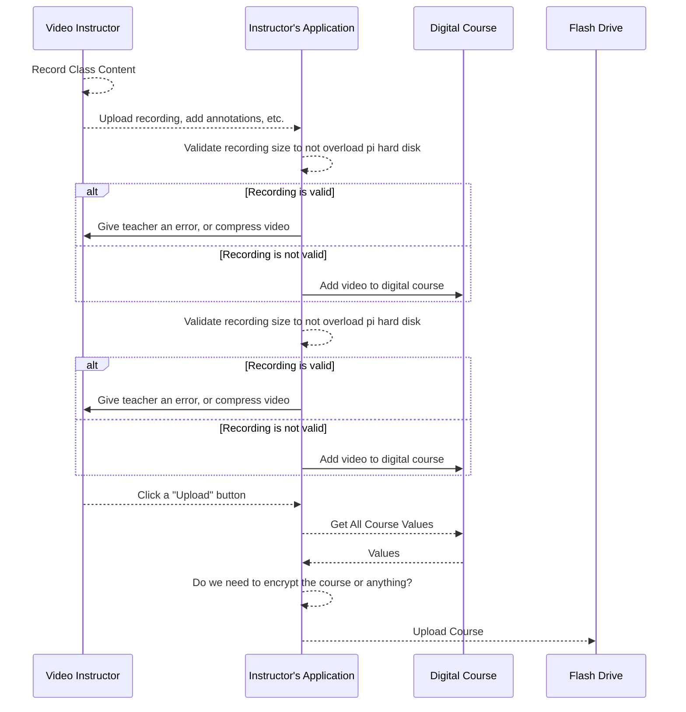
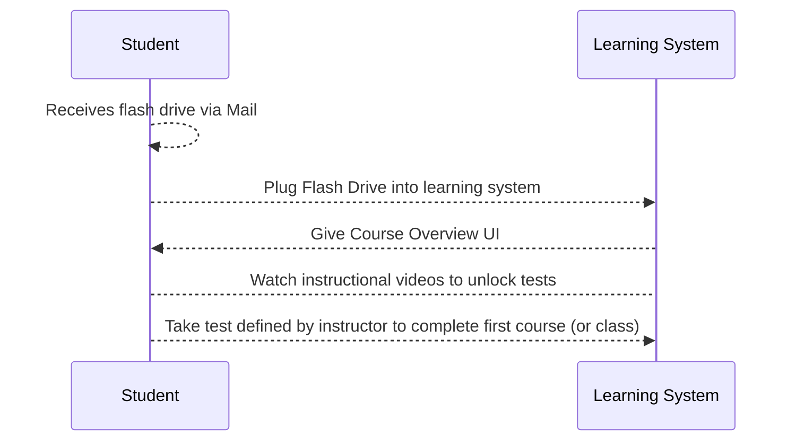

# Classroom Hub

The goal is to provide students in countries or areas without
internet a way to still have access to an education.

As of now there are two major ideas for how we can deliver on content.

1. The first would be the idea of a classroom "hub", though this may
   be particularly difficult to deliver on without a consistent internet
   or network connection. This "hub" could be a shared kiosk that allowed
   users to login with pre-defined credentials, which would be encrypted
   on the hard drive.

2. The second would be the idea of "individual learning devices", where
   perhaps we could build our own single-focus personal computer using a
   cheap personal machine like a raspberry pi or something similar and attach
   a screen ([perhaps a touch screen like this](https://www.amazon.com/Raspberry-Pi-7-Touchscreen-Display/dp/B0153R2A9I)).

The "learning devices" concept might be better in the long run if we can
create a reliable way for students to have their answers checked by the machine.

---

## The "Content Upload" Process

Since new video content cannot be uploaded to a cloud storage provider
like [AWS S3](https://aws.amazon.com/s3/), we will need a way to allow an
instructor to upload video content and send it to consumers of the learning
device.

## The "Delivery" Process

Assuming that our target consumers for of the content already have their
_learning devices_, the delivery of new educational content could be via
small, [snail mailed](https://whatis.techtarget.com/definition/snail-mail)
flash drives.

- When the user plugs in the flash drive, we could prompt them if they
  want to watch the course, see an overview, etc.
- When the user plugs in the flash drive we could even deliver system
  updates to their _learning systems_.

## The "Learning" Process

- Todo

## The "Grading" Process

- Todo

## The Concerns

- How do students using this platform ask questions?
